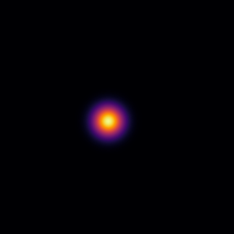
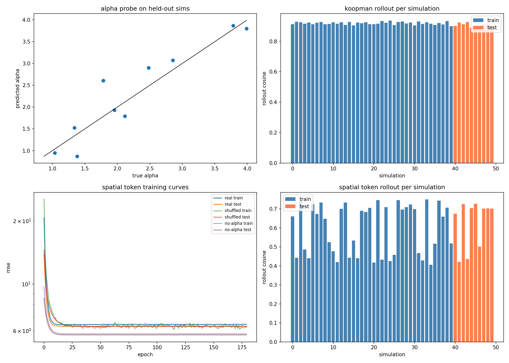
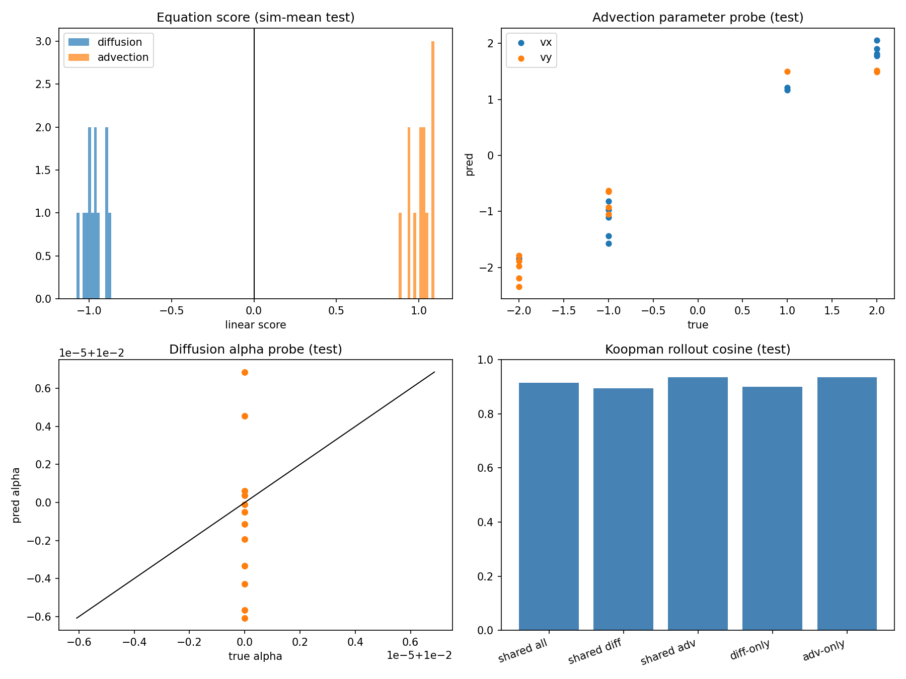
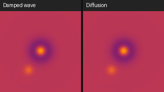
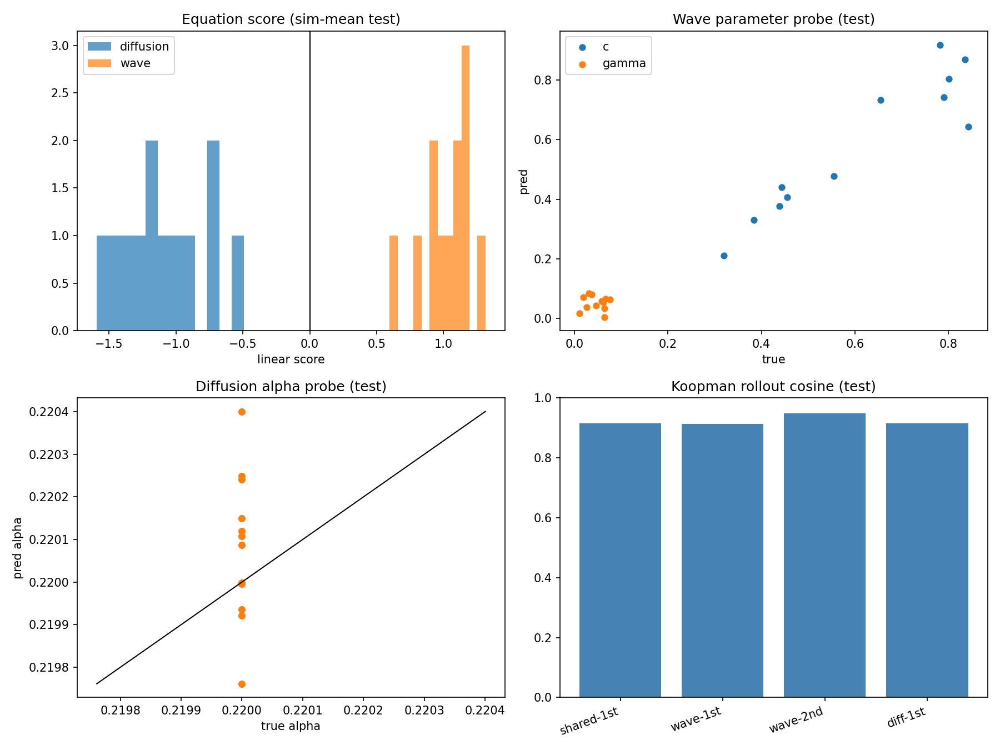

# Physics-Probe-VJEPA2

## Abstract

This repository is an exploratory, fast-turnaround study on whether a frozen video foundation model [V-JEPA 2](https://ai.meta.com/research/vjepa/) (`facebook/vjepa2-vitl-fpc64-256`) contains linearly accessible structure related to simple 2D physics.  
The core idea is not to train a new physics model, but to probe an existing representation with very small heads and ask: are simulation parameters and dynamics translatable from the latent space?

This is an interesting early signal, not proof of physical understanding. The dataset is small, the setting is synthetic, and the results should be treated as hypothesis-generating.

## Objective

Measure how much physics-relevant information is present in frozen V-JEPA2 embeddings by using tiny probes on controlled simulations.

Concrete questions:

1. Can the diffusion coefficient (`alpha`) be decoded from embeddings?
2. Do embedding trajectories follow approximately linear latent dynamics (Koopman-style)?
3. Are spatial token dynamics useful for PDE-like prediction?
4. Are we seeing real latent structure, or just a compressed pixel pipeline?

## Scope and Positioning

- This is a Phase 1 feasibility test.
- The experiments are intentionally lightweight and fast.
- Claims are restricted to this synthetic heat setup.
- No claim is made that V-JEPA2 "understands physics" in a strong scientific sense.

## Experimental Setup

### Data generation



- PDE system: 2D heat/diffusion (`heat/equation_sim.py`)
- Simulations: 50 total
- Split: 40 train / 10 test
- Per simulation:
  - Rendered frames + `params.json`
  - Ground truth includes `alpha`, Gaussian width `sigma`, and initialization metadata

### Frozen representation extraction

- Script: `heat/embed_sim.py`
- Model: frozen V-JEPA2
- Saved artifacts per simulation:
  - `per_frame.npy` (frame-level embedding)
  - `per_frame_norm.npy`
  - `tokens_spatial_fp16.npy` (`T x H x W x D`)
  - `embed_meta.json`

### Probes and dynamics models

- Main analysis script: `heat/try_to_fit.py`
- Probes:
  - Ridge regression for `alpha` decoding
  - Linear latent dynamics after PCA (`z_{t+1} = A z_t`)
  - Small depthwise spatial token head with three conditioning variants:
    - real alpha
    - shuffled alpha
    - no alpha

## Results (Phase 1)

Primary result files:

- `heat/results/fit_summary.txt`
- `heat/results/fit_metrics.json`
- `heat/results/fit_results.png`
- `heat/results/phase1_metrics_plot.png`

### Figures

Joint visualization of Phase 1 outcomes:



Aggregate metrics summary:


### 1) Alpha decodability

- Simulation-mean probe:
  - Train R2: `1.0000`
  - Test R2: `0.8515`
  - Test MAE: `0.287512`
- Frame-level probe:
  - Train R2: `0.9996`
  - Test R2: `0.8107`
  - Test MAE: `0.338030`

Interpretation: `alpha` is strongly linearly decodable from frozen embeddings in this setup.

### 2) Koopman-style latent dynamics (PCA-32)

- Spectral radius: `0.991239`
- One-step cosine:
  - Train: `0.9649`
  - Test: `0.9535`
- Rollout cosine:
  - Train: `0.9189 +/- 0.0087`
  - Test: `0.9057 +/- 0.0144`

Interpretation: a compact linear model captures embedding evolution well on held-out simulations.

### 3) Spatial token diffusion head

- Final train/test losses:
  - Real alpha: `6.431118e+00 / 6.292509e+00`
  - Shuffled alpha: `6.267228e+00 / 6.279049e+00`
  - No alpha: `5.793063e+00 / 5.729559e+00`
- Rollout cosine:
  - Train: `0.5964 +/- 0.1283`
  - Test: `0.6298 +/- 0.1181`

Interpretation: useful but weaker than the global Koopman baseline in Phase 1.

## Pixel-vs-Embedding Falsification

### Failure mode being tested

A key concern is that good probe performance might come from near-raw pixel compression rather than meaningful latent structure.  
If that were true, simple pixel features should perform similarly to embeddings.

### Test design

Script: `heat/pixel_vs_embed_falsification.py`

Compared across multi-seed stratified splits (`seeds=[42,43,44,45,46]`, 40 train / 10 test per seed):

1. Embedding features (`per_frame.npy`)
2. Pixel baselines (`rgb16`, `gray16`, `rgb32`, `crop_patch16`)

Matched evaluations:

- `alpha` probes (simulation-mean and frame-level), with CV-tuned ridge per modality
- Koopman rollouts (same latent dimension/protocol), plus time-shuffled control
- Cross-modal linear predictability (`pixel -> embedding`, `embedding -> pixel`)
- Aggregate reporting with mean/std and 95% CI across seeds

Outputs:

- `heat/results/pixel_falsification_summary.txt`
- `heat/results/pixel_falsification_metrics.json`

### Falsification results (current multi-seed run, 50 sims)

- Embedding Koopman rollout cosine (test): `0.9109 +/- 0.0041`, 95% CI `[0.9073, 0.9144]`
- Best pixel Koopman rollout cosine (test): `0.3692 +/- 0.1343`, 95% CI `[0.2515, 0.4868]`
- Koopman gap (embedding - best pixel): `+0.5417 +/- 0.1321`, 95% CI `[0.4259, 0.6575]`
- Best `pixel -> embedding` linear total R2: `-0.0241 +/- 0.0662`, 95% CI `[-0.0822, 0.0339]`
- Alpha probe (simulation-mean) is unstable across seeds:
  - Embedding: `0.1664 +/- 1.6337`, 95% CI `[-1.2656, 1.5984]`
  - Best pixel: `0.6787 +/- 0.1102`, 95% CI `[0.5821, 0.7753]`
  - Outlier behavior appears in one seed due hyperparameter sensitivity (sim-level probe), while frame-level embedding alpha probe remains high in all seeds (`~0.83` to `~0.94` test R2).

Interpretation: the strong anti-pixel signal is robust for dynamics and weak for direct pixel->embedding reconstruction. Alpha-sim decoding is currently sensitive and not stable enough for strong claims.

## Cross-Equation Stress Tests

To push the postulation harder, two paired datasets were added where each pair starts from the same initial blob field but uses a different governing equation.

### A) Pure advection vs pure diffusion


Pipeline:

- `advection_diffusion/equation_sim.py`
- `advection_diffusion/embed_sim.py`
- `advection_diffusion/try_to_fit.py`

Artifacts:

- `advection_diffusion/results/fit_summary.txt`
- `advection_diffusion/results/fit_metrics.json`
- `advection_diffusion/results/fit_results.png`

Figure:



Key outcomes (test split):

- Equation classification (sim-mean and frame): `1.0000` accuracy
- Parameter probe (advection): `vx R2=0.9713`, `vy R2=0.9532`
- Koopman rollout cosine (shared model): overall `0.9154`, diffusion `0.8951`, advection `0.9357`

Important caveat:

- Diffusion `alpha` collapsed to a single matched value in this run (`alpha=0.01` for all diffusion sims), so diffusion-alpha `R2` is not interpretable here.

Interpretation:

- Latents separate transport vs diffusion regimes very strongly and preserve directional velocity information with high linear recoverability.

### B) Damped wave vs diffusion



Pipeline:

- `wave_diffusion/equation_sim.py`
- `wave_diffusion/embed_sim.py`
- `wave_diffusion/try_to_fit.py`

Artifacts:

- `wave_diffusion/results/fit_summary.txt`
- `wave_diffusion/results/fit_metrics.json`
- `wave_diffusion/results/fit_results.png`

Figure:



Key outcomes (test split):

- Equation classification (sim-mean and frame): `1.0000` accuracy
- Parameter probe (wave): `c R2=0.7775`, `gamma R2=-1.4275`
- Koopman rollout cosine:
  - shared first-order: `0.9147`
  - wave first-order: `0.9131`
  - wave second-order: `0.9482`
  - diffusion first-order: `0.9157`

Important caveat:

- Diffusion `alpha` again collapsed to a single matched value in this run (`alpha=0.22`), so diffusion-alpha `R2` is not interpretable in this dataset either.

Interpretation:

- Wave dynamics are captured better with a second-order latent transition than a first-order one, which is the expected structural signature for a wave-type system.
- `gamma` is not yet robustly decodable in this setup.

### Combined take from stress tests

- Strong support for equation-type and dynamics-structure separability in frozen embeddings.
- Strong evidence that latent dynamics are not behaving like a trivial single-regime smoothing model.
- Parameter-level claims remain partial: velocity and wave speed decode well; damping and diffusion-alpha need improved data variation and controls.

## Conservative Conclusion

What this supports:

- Frozen V-JEPA2 embeddings contain easily probeable information correlated with heat-physics parameters.
- Their temporal evolution is highly structured and approximated well by a low-dimensional linear model.
- A straightforward pixel-only explanation does not fit the observed metrics.

What this does not prove:

- It does not prove true physical understanding.
- It does not establish broad out-of-domain generalization.
- It does not establish causality, mechanistic grounding, or scientific discovery capability.

## Limitations and Threats to Validity

- Small sample size (50 simulations).
- Single PDE family (diffusion only).
- Single model backbone.
- Only 5 seeds so far; one seed shows unstable sim-level alpha behavior.
- Synthetic rendering pipeline can introduce shortcuts.
- In the new paired stress tests, matched-diffusion generation collapsed diffusion `alpha` to a single value, invalidating alpha-R2 interpretation there.

## Next Research Steps

1. Run multiple seeds and report confidence intervals.
2. Scale simulation count and parameter coverage.
3. Compare against other frozen video encoders.
4. Add different dynamics families (wave, advection, reaction-diffusion).
5. Improve spatial operators and regularization.
6. Force broad diffusion-alpha variation in paired datasets while preserving visual matching.
7. Test robustness under rendering perturbations and distribution shifts.

## Reproducibility

Run from project root:

```bash
python "heat/equation_sim.py"
python "heat/embed_sim.py"
python "heat/try_to_fit.py"
python "heat/pixel_vs_embed_falsification.py"
python "advection_diffusion/equation_sim.py"
python "advection_diffusion/embed_sim.py"
python "advection_diffusion/try_to_fit.py"
python "wave_diffusion/equation_sim.py"
python "wave_diffusion/embed_sim.py"
python "wave_diffusion/try_to_fit.py"
```

Main artifacts:

- `heat/results/fit_summary.txt`
- `heat/results/fit_metrics.json`
- `heat/results/pixel_falsification_summary.txt`
- `heat/results/pixel_falsification_metrics.json`
- `heat/results/spatial_heat_head.pt`
- `advection_diffusion/results/fit_summary.txt`
- `advection_diffusion/results/fit_metrics.json`
- `advection_diffusion/results/fit_results.png`
- `wave_diffusion/results/fit_summary.txt`
- `wave_diffusion/results/fit_metrics.json`
- `wave_diffusion/results/fit_results.png`
