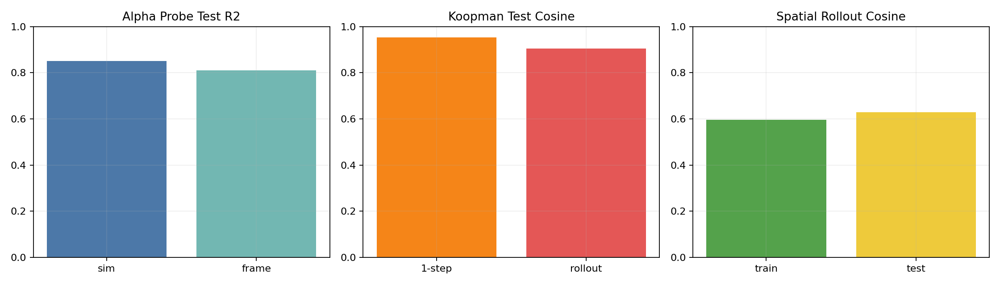

# Physics-Probe-VJEPA2

Phase 1 experiments to test whether a frozen V-JEPA2 representation encodes usable 2D physics structure (heat/diffusion), and how to extract that structure.

## Goal

Use a frozen video model (`facebook/vjepa2-vitl-fpc64-256`) and small heads/probes to recover physics-relevant information from synthetic 2D simulations.

Main questions:

1. Is the diffusion parameter (`alpha`) linearly decodable?
2. Are dynamics in embedding space approximately linear (Koopman-style)?
3. Does preserving spatial token structure help PDE-like prediction?

## Phase 1 setup

- Task: 2D heat/diffusion simulation (`heat/equation_sim.py`)
- Dataset: 50 simulations, split 40 train / 10 test
- Per simulation:
  - Frames + `params.json`
  - Embeddings:
    - `per_frame.npy` (raw frame embedding)
    - `per_frame_norm.npy`
    - `tokens_spatial_fp16.npy` (`T x H x W x D`)
    - `embed_meta.json`
- Train/eval script: `heat/try_to_fit.py`
- Metrics artifacts:
  - `heat/results/fit_summary.txt`
  - `heat/results/fit_metrics.json`

## Experiment ideas used in Phase 1

### 1) Linear alpha probe

Predict `alpha` from frozen embeddings with ridge regression.

- Probe A: simulation-mean embedding -> `alpha`
- Probe B: per-frame embedding -> `alpha`

### 2) Koopman latent dynamics

- Reduce embeddings with PCA to latent dim 32
- Fit linear transition `z_{t+1} = A z_t`
- Evaluate one-step and long rollout on held-out simulations
- Inspect spectral radius of `A` (dissipative systems should be < 1)

### 3) Spatial token diffusion head

- Keep spatial token grid (`H x W`)
- Train depthwise local operator with:
  - real alpha
  - shuffled alpha baseline
  - no-alpha baseline
- Evaluate rollout cosine on train/test simulations

## Phase 1 results

Fit results:


From `heat/results/fit_summary.txt` and `heat/results/fit_metrics.json`:

### Phase 1 plots

Summary plot generated from Phase 1 metrics:



If you also generated the full experiment figure from `heat/try_to_fit.py`, place/reference it here:

`heat/results/fit_results.png`

### Alpha linear probe

- Sim-mean probe:
  - Train R2: `1.0000`
  - Test R2: `0.8515`
  - Train MAE: `0.000071`
  - Test MAE: `0.287512`
- Frame-level probe:
  - Train R2: `0.9996`
  - Test R2: `0.8107`
  - Train MAE: `0.018798`
  - Test MAE: `0.338030`

Interpretation: `alpha` is strongly encoded in frozen embeddings.

### Koopman latent dynamics (PCA-32)

- Spectral radius: `0.991239`
- One-step:
  - Train MSE: `3.458938e-01`
  - Test MSE: `4.928611e-01`
  - Train cosine: `0.9649`
  - Test cosine: `0.9535`
- Rollout:
  - Train cosine: `0.9189 +/- 0.0087`
  - Test cosine: `0.9057 +/- 0.0144`

Interpretation: very strong generalizing dynamics in frozen representation; near-linear latent evolution captures held-out trajectories well.

### Spatial token diffusion head

- Final losses:
  - Real alpha train/test: `6.431118e+00 / 6.292509e+00`
  - Shuffled alpha train/test: `6.267228e+00 / 6.279049e+00`
  - No alpha train/test: `5.793063e+00 / 5.729559e+00`
- Rollout cosine:
  - Train: `0.5964 +/- 0.1283`
  - Test: `0.6298 +/- 0.1181`

Interpretation: spatial head learns useful but weaker dynamics than Koopman in this phase; explicit multiplicative alpha conditioning is not yet helping.

## Pixel-vs-Embedding falsification

The failure mode we want to reject is this: our strong Phase 1 results might come from a near-identity compression of rendered frames, not from a representation that captures transferable physical structure. In other words, if V-JEPA embeddings were mostly \"downsampled pixels in disguise,\" then simple pixel baselines should match embedding performance on alpha decoding and dynamics.

To test that directly, `heat/pixel_vs_embed_falsification.py` runs matched experiments on:

- Embeddings (`per_frame.npy`)
- Raw pixel features (RGB frames downsampled to `16 x 16`, then flattened)

Using the same train/test split, it compares:

1. Alpha probes (simulation-mean and frame-level ridge regression)
2. Koopman rollouts (same latent dimension and protocol for both modalities)
3. Cross-modal linear predictability (`pixel -> embedding` and `embedding -> pixel`)

Artifacts are written to:

- `heat/results/pixel_falsification_summary.txt`
- `heat/results/pixel_falsification_metrics.json`

Current 50-simulation results:

- Alpha probe (simulation-mean, test R2): embedding `0.8515` vs pixels `0.5836`
- Alpha probe (frame-level, test R2): embedding `0.8107` vs pixels `-5132.1204`
- Koopman rollout (test cosine mean): embedding `0.9057 +/- 0.0144` vs pixels `0.2988 +/- 0.2724`
- Linear `pixel -> embedding` (test total R2): `-8461.9281`

Interpretation: the embedding pipeline is not behaving like a simple pixel compressor on this dataset. If it were, pixel features would achieve similar alpha/dynamics performance and would linearly reconstruct embeddings well. They do not.


## Did Phase 1 accomplish anything?

Yes.

- Parameter information is decodable (`alpha` probe test R2 > 0.8).
- Dynamics are highly recoverable in a compact linear latent model (Koopman rollout cosine ~0.91 on held-out sims).
- Evidence suggests frozen V-JEPA2 embeddings carry structured, transferable physical information for diffusion.

## Next steps (Phase 2)

Phase 2 focuses on **automatically extracting physical insight from frame embeddings alone** — no ground-truth parameters, no hand-crafted PDE structure. The goal is to discover that a system is diffusive, wave-like, or otherwise structured purely from the embedding trajectory. TO-DO dream.

## Reproduce Phase 1 (heat pipeline)

Run from project root:

```bash
python "heat/equation_sim.py"
python "heat/embed_sim.py"
python "heat/try_to_fit.py"
```

Primary outputs:

- `heat/results/fit_summary.txt`
- `heat/results/fit_metrics.json`
- `heat/results/spatial_heat_head.pt`

